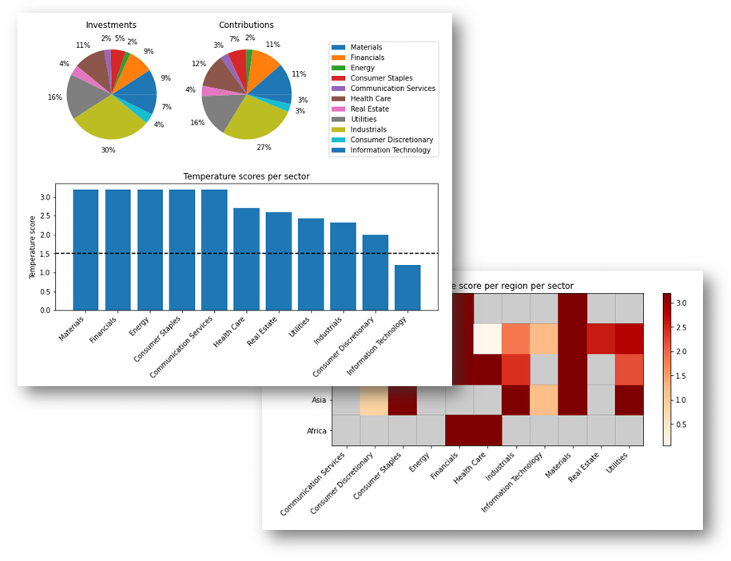

SBTi-Finance Tool for Temperature Scoring & Portfolio Coverage
==============================================================

.. note:: This tool implements `Version 1.0 <https://sciencebasedtargets.org/wp-content/uploads/2020/09/Temperature-Rating-Methodology-V1.pdf>`__ of the CDP/WWF Temperature Rating Methodology, for setting and reporting on SBTi Financial Institutions Near-Term Targets. For Version 1.5 of the methodology, please refer to the `CDP-WWF Temperature Scoring Methodology <https://www.cdp.net/en/data-licenses/net-zero-alignment-dataset/the-cdp-wwf-temperature-scoring-methodology>`__.

*Do you want to understand what drives the temperature score of your
portfolio to make better engagement and investment decisions?*

|image1|

Based on Version 1.0 of the temperature scoring method, developed by CDP and WWF, this
tool helps companies and financial institutions to assess the
temperature alignment of current emission reduction targets,
commitments, and investment and lending portfolios. They can for
instance use this information to develop their own GHG emission
reduction targets for official validation by the Science Based Targets
initiative (SBTi), develop engagement strategies and help with strategic
security selection and allocation decisions.

This chapter provides a non-technical introduction and overview of what
the tool is for, the types of outputs it delivers, what data is
required, how it works, and where you can find more information and
documentation to start using the tool.

An introduction to the technical documentation
----------------------------------------------

The SBTi-Finance tool has been built as an open-source, data-agnostic
tool and works with input data from any data provider and in many
different IT infrastructures.

Quickstart
----------

-  **Python package**: Install via ``pip install sbti-finance-tool`` and integrate directly into your codebase. See the `Getting Started Using Python <getting_started.html>`__ section.

-  **Jupyter notebooks**: Run the `example notebooks <https://github.com/ScienceBasedTargets/SBTi-finance-tool/tree/main/examples>`__ on Google Colab or locally. Start with the `Analysis example <https://colab.research.google.com/github/ScienceBasedTargets/SBTi-finance-tool/blob/main/examples/1_analysis_example.ipynb>`__.

-  **REST API**: Deploy the tool as a containerized microservice. See the `Getting Started Using REST API <rest_api.html>`__ section.

Given the open source nature of the tool, the community is encouraged to
make contributions (refer to the `Contributing <contributing.html>`__ section) to further develop
and/or update the codebase. Contributions can range from submitting a
bug report, to submitting a new feature request, all the way to further
enhancing the tool's functionalities by contributing code.

.. toctree::
   :maxdepth: 4
   :caption: Contents:

   intro
   getting_started
   rest_api
   FunctionalOverview
   DataRequirements
   Legends
   contributing
   links
   terms
