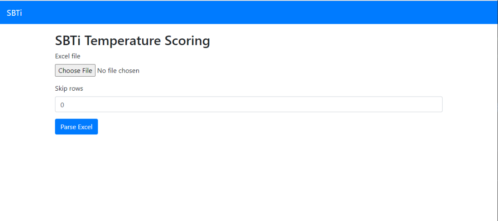

********************
REST API & UI
********************
The provided REST API makes it easy to integrate the SBTi temperature alignment tool as a microservice in your current IT infrastructure.
Optionally you can also run the REST API with a small frontend, that makes testing substantially easier.

Usage
====================
The complete REST API reference is available `here <https://ofbdabv.github.io/SBTi/swagger/index.html>`_.

Installation
====================
The tool is containerized in a Docker container. This enables easy cloud and on-premise deployments.
We'll provide instructions here for installing the REST API either on your local machine or on Amazon AWS.

Locally
********************

* **Step 1**: Install Docker desktop

For testing locally on your own Windows or Mac PC we first need to have a Docker engine running.
For Linux users, this natively available in your OS and you can skip step 1. Docker provides some excellent installation
instructions for `Windows <https://docs.docker.com/docker-for-windows/install/>`_ and
`Mac <https://docs.docker.com/docker-for-mac/install/>`_. After you've finished these installation guides, we'll continue
with step 2.

* **Step 2**: Download and run the SBTi container.
The project consists of two containers, the `API <https://hub.docker.com/r/sbti/api>`_ and the `UI <https://hub.docker.com/r/sbti/ui>`_, both of which can be found on Docker Hub.
You can choose whether you only want to run the API or also the UI. To run them, you need to download a compose file. If you only want to run the API, you need to use `this file <https://raw.githubusercontent.com/OFBDABV/SBTi_api/master/docker-compose.yml>`_, if you also want the UI, you should use `this file <https://raw.githubusercontent.com/OFBDABV/SBTi_api/master/docker-compose-ui.yml>`_.

Now download the file of your choose and store it as `docker-compose.yml` in your home directory.

*For Windows users*

1. Open Command Prompt from a Start Menu Search. Select "Run as administrator".

2. You can easily open the Command Prompt by clicking Start and then typing "cmd" into the search box.

.. image:: restapi-deploy-windows-1.png
    :width: 500px
    :align: center
    :alt: alternate text

3. Enter the following command and hit enter::

    docker-compose up

.. image:: restapi-deploy-windows-2.png
    :width: 500px
    :align: center
    :alt: alternate text

.. note:: This command assumes that your command prompt is currently in the same directory as the docker-compose.yml file that you downloaded earlier.

4. This commando starts retrieving the latest version of the tool and will expose it at localhost:5000
5. Open your browser and go to http://localhost:5000 to access the tool. If you're running the UI, the UI will be on http://localhost:5000 and the API on http://localhost:5001

*For Mac users*

1. One of the quickest and easiest ways to open Terminal on Mac is with Spotlight Search
2. If you have the Spotlight Search button in your menu bar, click it. Otherwise, you can use the keyboard shortcut Command + Space
3. Type in "Terminal"
4. You should see the Terminal application under Top Hit at the top of your results. Double-click it and Terminal will open.

.. image:: restapi-deploy-mac-1.jpg
    :width: 500px
    :align: center
    :alt: alternate text

5. Enter the following command and hit enter::

    docker-compose up

.. note:: This command assumes that your command prompt is currently in the same directory as the docker-compose.yml file that you downloaded earlier.

4. This commando starts retrieving the latest version of the tool and will expose it at localhost:5000
5. Open your browser and go to http://localhost:5000 to access the tool. If you're running the UI, the UI will be on http://localhost:5000 and the API on http://localhost:5001

Amazon AWS
*********************
These instructions assume that you've installed and configured the Amazon `AWS CLI tools <https://docs.aws.amazon.com/cli/latest/userguide/install-cliv2.html) and the [ECS CLI tools](https://docs.aws.amazon.com/AmazonECS/latest/developerguide/ECS_CLI_Configuration.html>`_ with an IAM account that has at least write access to ECS and EC2 and the capability of creating AIM roles.

1. Configure the cluster. You can update the region and names as you see fit::

    ecs-cli configure --cluster sbti-ecs-cluster --region eu-central-1 --config-name sbti-ecs-conf --cfn-stack-name sbti-ecs-stack --default-launch-type ec2

2. Create a new key pair. The result of this command is a key. Store this safely as you can later use it to access your instance through SSH::

    aws ec2 create-key-pair --key-name sbti

3. Create the instance that'll run the image. Here we used 1 server of type t2.medium. Change this as you see fit::

    ecs-cli up --keypair sbti --capability-iam --size 1 --instance-type t2.medium --cluster-config sbti-ecs-conf

4. Update the server and make it run the docker image::

    ecs-cli compose -f docker-compose_aws.yml up --cluster-config sbti-ecs-conf

5. Now that the instance is running we can't access it yet. That's because NGINX only listens to localhost. We need to change this to make sure it's accessible on the WWW.
6. Login to the Amazon AWS console
7. Go to the EC2 service
8. In the instance list find the instance running the Docker image
9. Copy the public IP address of the instance
10. In config/flask-site-nginx.conf update the server name to the public IP.
11. Now we need to rebuild and re-upload the image::

     docker-compose -f docker-compose_aws.yml build --no-cache
     docker-compose -f docker-compose_aws.yml push
     ecs-cli compose -f docker-compose_aws.yml up --cluster-config sbti-ecs-conf --force-update

12. You should now be able to access the API.

.. warning:: This will make the API publicly available on the world wide web! Please note that this API is not protected in any way. Therefore it's recommended to run your instance in a private subnet and only access it through there. Alternatively you can change the security group settings to only allow incoming connections from your local IP or company VPN.

.. toctree::
   :maxdepth: 4
